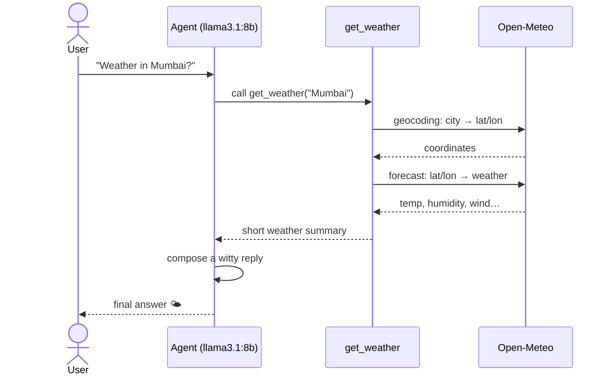

# lalalangchain — Basic Weather Agent

A minimal LangChain agent that answers weather queries using a **local LLM via Ollama** and **free public APIs** — no API keys required.

## What this lesson covers

- Defining a custom LangChain `@tool`
- Creating an agent with `create_agent` (from `deepagents`)
- Wiring a local Ollama model as the LLM backend
- Calling external REST APIs from within a tool

## How it works



1. The agent (LLM) receives the user prompt and decides to call the `get_weather` tool.
2. The tool resolves the city to coordinates via the [Open-Meteo geocoding API](https://open-meteo.com/en/docs/geocoding-api), then fetches current temperature, humidity, wind speed, and weather code from the [Open-Meteo forecast API](https://open-meteo.com/en/docs).
3. The tool returns a short summary **back to the agent**, which then composes the final humorous reply for the user.

## Requirements

- Python 3.12+
- [Ollama](https://ollama.com) running locally with `llama3.1:8b` pulled
- [uv](https://docs.astral.sh/uv/)

## Setup

```bash
# Pull the model (one-time)
ollama pull llama3.1:8b

# Install Python dependencies
uv sync
```

## Run

```bash
uv run main.py
```

The script asks the agent _"What is the weather today like in Mumbai?"_ and prints the response.

## Key files

| File | Purpose |
|---|---|
| [main.py](main.py) | Agent definition, `get_weather` tool, and entry point |
| [pyproject.toml](pyproject.toml) | Project dependencies |

## Dependencies

| Package | Role |
|---|---|
| `langchain` | Agent framework |
| `langchain-ollama` | Ollama LLM integration |
| `deepagents` | `create_agent` helper |
| `requests` | HTTP calls to Open-Meteo |

---

> One of several standalone LangChain lessons — see the [`main` branch](../../tree/main) for the full list.
