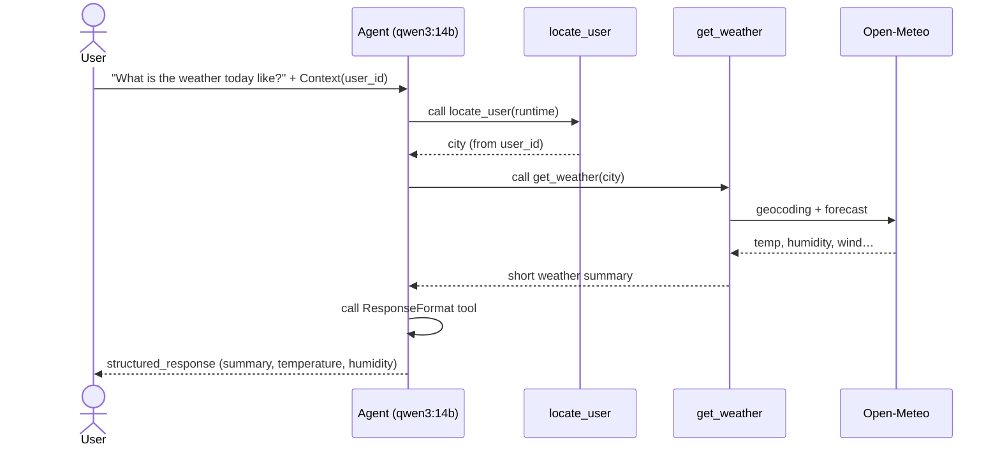

# lalalangchain — Stage 2: Context-Aware Agent

Building on [Stage 1](../../tree/stage-1), the agent now knows **who** it's talking to, returns **structured data** instead of free-form text, and **remembers** the conversation across turns.

## What this stage covers

- Passing per-invocation data with a `context_schema` and `ToolRuntime[Context]`
- A `locate_user` tool that resolves a user's city from their `user_id`
- Structured output with a `ResponseFormat` dataclass via `response_format`
- Conversation memory with an `InMemorySaver` checkpointer and a `thread_id`
- Swapping in `qwen3:14b` with reasoning disabled

## How it works



1. The user prompt arrives **without a city** — but with a `Context(user_id=...)`.
2. The agent calls `locate_user`, which reads `runtime.context.user_id` and maps it to a city.
3. It then calls `get_weather` for that city (same Open-Meteo flow as Stage 1).
4. Instead of replying in plain text, the agent calls the **`ResponseFormat` tool**, so the result comes back as a typed `ResponseFormat(summary, temperature_celsius, humidity)` in `response['structured_response']`.
5. The `InMemorySaver` checkpointer persists the message history under the `thread_id`, so follow-up turns retain context.

## Why instruct the model to call `ResponseFormat`?

`ChatOllama` doesn't advertise a model profile, so LangChain can't detect that Ollama supports native structured output and falls back to its **tool strategy** — `structured_response` is only populated when the model calls a hidden `ResponseFormat` tool. Left to itself, qwen3 tends to answer in plain text (leaving the key absent). Forcing Ollama's JSON-output mode instead would suppress tool calling entirely, so the weather tools would never run. The reliable fix is to keep the tool strategy and tell the model in the system prompt to deliver its final answer via the `ResponseFormat` tool.

## Requirements

- Python 3.12+
- [Ollama](https://ollama.com) running locally with `qwen3:14b` pulled
- [uv](https://docs.astral.sh/uv/)

## Setup

```bash
# Pull the model (one-time)
ollama pull qwen3:14b

# Install Python dependencies
uv sync
```

## Run

```bash
uv run main.py
```

The script asks _"What is the weather today like?"_ as user `ABC123` (Patna) and prints the structured summary.

## Key files

| File | Purpose |
|---|---|
| [main.py](main.py) | Agent, `get_weather` + `locate_user` tools, `Context`/`ResponseFormat`, entry point |
| [pyproject.toml](pyproject.toml) | Project dependencies |

## Dependencies

| Package | Role |
|---|---|
| `langchain` | Agent framework |
| `langchain-ollama` | Ollama LLM integration |
| `langgraph` | Checkpointer / conversation memory |
| `deepagents` | `create_agent` helper |
| `requests` | HTTP calls to Open-Meteo |

---

> Part of a multi-stage tutorial — see the [`main` branch](../../tree/main) for all stages.
