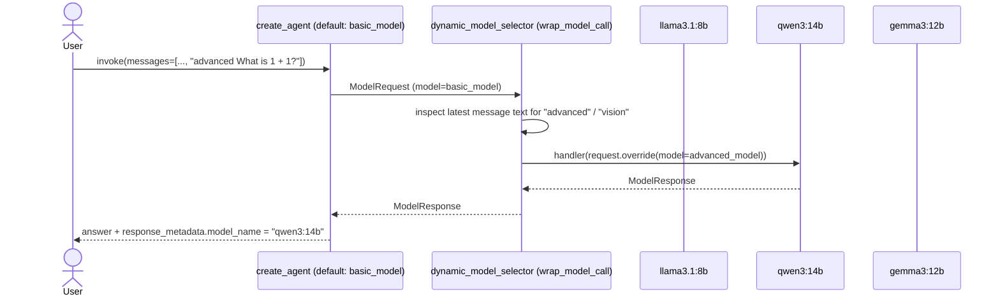

# lalalangchain — Dynamic Model Selection

Routing a single agent across **multiple local models** at runtime, based on what the incoming message actually needs, using `@wrap_model_call` middleware.

## What this lesson covers

- `@wrap_model_call` middleware: wraps the model-invocation step itself, receiving both the `ModelRequest` and a `handler` to (optionally) continue the call
- Picking a different `ChatOllama` model per request by inspecting the latest message's text (`request.messages[-1].text`)
- Swapping the model with `request.override(model=...)` — the immutable-update pattern for `ModelRequest` — then delegating to `handler(...)` to actually run it
- Confirming which model answered via `response["messages"][-1].response_metadata["model_name"]`

## How it works



1. Three `ChatOllama` instances are created up front: `basic_model` (`llama3.1:8b`), `advanced_model` (`qwen3:14b`), and `vision_model` (`gemma3:12b`).
2. `create_agent` is given `basic_model` as its default, but also `middleware=[dynamic_model_selector]`.
3. On every model call, `dynamic_model_selector` looks at the latest message's text and picks a model by keyword (`"advanced"` → `advanced_model`, `"vision"` → `vision_model`, else the default).
4. It calls `handler(request.override(model=chosen_model))` — `override` returns a new, immutable `ModelRequest` with just the `model` field swapped, and `handler` runs the actual model call with it.

## Why this is interesting

Earlier lessons pick one model for the whole agent. `wrap_model_call` middleware makes the model itself a runtime decision — the same agent can route trivial requests to a small, fast model and reserve a bigger model for requests that ask for it, without spinning up multiple agents. This is also the extension point behind built-ins like `model_fallback` middleware (retry with a different model on error) — same `request.override(model=...)` + `handler(...)` shape, different trigger.

## Requirements

- Python 3.12+
- [Ollama](https://ollama.com) running locally with `llama3.1:8b`, `qwen3:14b`, and `gemma3:12b` pulled
- [uv](https://docs.astral.sh/uv/)

## Setup

```bash
ollama pull llama3.1:8b
ollama pull qwen3:14b
ollama pull gemma3:12b
uv sync
```

## Run

```bash
uv run main.py
```

Sends "advanced What is 1 + 1?" — the `"advanced"` keyword routes the call to `qwen3:14b`, and the script prints the answer plus the model name that actually served it.

## Key files

| File | Purpose |
|---|---|
| [main.py](main.py) | Defines the three models, the `wrap_model_call` middleware, and runs the agent |
| [pyproject.toml](pyproject.toml) | Project dependencies |

## Dependencies

| Package | Role |
|---|---|
| `langchain` | `create_agent` and the `middleware` module (`wrap_model_call`, `ModelRequest`, `ModelResponse`) |
| `langchain-ollama` | `ChatOllama` |

---

> One of several standalone LangChain lessons — see the [`main` branch](../../tree/main) for the full list.
