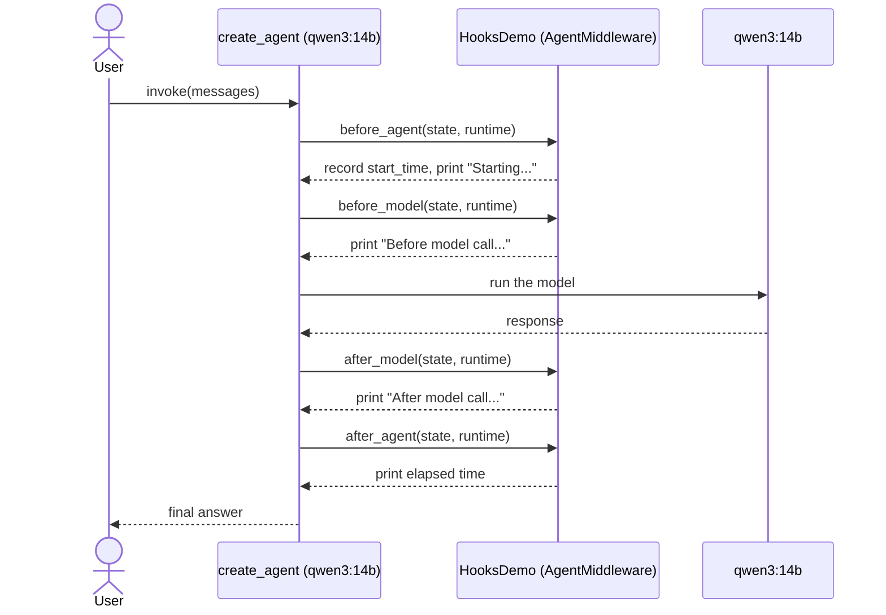

# lalalangchain — Agent Lifecycle Hooks

Instrumenting an agent's execution with a custom `AgentMiddleware` subclass — hooking into the run before/after the agent starts and before/after each model call, without touching the agent's core logic.

## What this lesson covers

- Subclassing `AgentMiddleware` and overriding its lifecycle hooks: `before_agent`, `before_model`, `after_model`, `after_agent`
- Keeping state across hooks on the middleware instance itself (`self.start_time`)
- Attaching middleware to `create_agent` via `middleware=[HooksDemo()]`
- Timing a full agent run end-to-end without modifying the agent's prompt or tools

## How it works



1. `HooksDemo` extends `AgentMiddleware` and overrides four lifecycle hooks, each receiving the current `AgentState` and `runtime`.
2. `before_agent` fires once, at the very start of `agent.invoke(...)`, and stamps `self.start_time`.
3. `before_model` / `after_model` fire around every model call — with a single-turn, tool-free agent that's exactly once here, but they'd fire per iteration in a multi-step tool-calling loop.
4. `after_agent` fires once the whole run is done, and prints the elapsed wall-clock time using the timestamp stashed in `before_agent`.
5. The answer is read from `response["messages"][-1]` — the **last** message, not the first (which is just the `SystemMessage` echoed back in the state).

## Why this is interesting

Middleware hooks are a clean way to add cross-cutting behavior — logging, timing, metrics, guardrails — around an agent's run without touching its prompt, tools, or business logic. `before_model`/`after_model` are the more interesting pair for agents that loop over multiple tool calls: they'd fire once per model invocation, not once per `agent.invoke()`, making them a natural place to log or short-circuit each step.

## Requirements

- Python 3.12+
- [Ollama](https://ollama.com) running locally with `qwen3:14b` pulled
- [uv](https://docs.astral.sh/uv/)

## Setup

```bash
ollama pull qwen3:14b
uv sync
```

## Run

```bash
uv run main.py
```

Prints each lifecycle hook firing in order, the elapsed time, and the model's answer to "What is the capital of France?".

## Key files

| File | Purpose |
|---|---|
| [main.py](main.py) | Defines `HooksDemo` and runs the agent with it attached |
| [pyproject.toml](pyproject.toml) | Project dependencies |

## Dependencies

| Package | Role |
|---|---|
| `langchain` | `create_agent` and the `middleware` module (`AgentMiddleware`, `AgentState`) |
| `langchain-ollama` | `ChatOllama` |

---

> One of several standalone LangChain lessons — see the [`main` branch](../../tree/main) for the full list.
