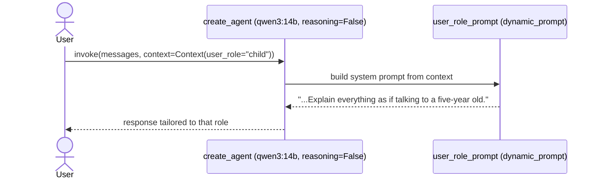

# lalalangchain — Dynamic Prompt Middleware

Reshaping an agent's system prompt at runtime based on **who's asking**, using `context_schema` and a `@dynamic_prompt` middleware — plus a look at disabling `qwen3`'s reasoning mode for simple, latency-sensitive queries.

## What this lesson covers

- Passing per-invocation data with a `context_schema` (here, a `user_role`)
- `@dynamic_prompt` middleware: a function that builds the system prompt from `request.runtime.context` on every call
- Branching prompt behavior with `match` on the context field (`"expert"`, `"beginner"`, `"child"`)
- Disabling `qwen3:14b`'s thinking mode with `ChatOllama(reasoning=False)` — and why that's a large latency/token win for a question that doesn't need deliberation
- Reading the agent's answer directly (`response["messages"][-1].content`) instead of dumping the whole state

## How it works



1. `Context` is a small dataclass holding `user_role`.
2. `user_role_prompt`, decorated with `@dynamic_prompt`, reads `request.runtime.context.user_role` and returns a different system prompt per role via `match`.
3. `create_agent` is wired with `context_schema=Context` and `middleware=[user_role_prompt]`, so the prompt is rebuilt on every invocation rather than fixed at agent-creation time.
4. `ChatOllama(model="qwen3:14b", reasoning=False)` turns off the model's thinking phase — the same question runs in a fraction of the time and output tokens with no visible quality loss for something this simple.

## Why this is interesting

Earlier lessons pass a `system_prompt` string that's fixed once, at agent construction. `@dynamic_prompt` middleware makes the prompt a function of **runtime context**, so the same agent instance can speak differently to an expert, a beginner, or a child without rebuilding it per request.

Separately: `qwen3:14b` thinks by default (visible via `ollama run`, and via extra latency even when `langchain-ollama` hides the `<think>` tags from `content`). Benchmarking the same prompt with `reasoning=None` vs. `reasoning=False` showed roughly a **6x** drop in response time and output tokens for this question — most of the default run's tokens were invisible reasoning, not the answer. Reasoning is worth keeping for genuinely hard problems, but it's dead weight for something like "explain how a car engine works."

## Requirements

- Python 3.12+
- [Ollama](https://ollama.com) running locally with `qwen3:14b` pulled
- [uv](https://docs.astral.sh/uv/)

## Setup

```bash
ollama pull qwen3:14b
uv sync
```

## Run

```bash
uv run main.py
```

Prints the agent's answer to "Explain how a car engine works.", phrased for the `user_role` set in `main()`.

## Key files

| File | Purpose |
|---|---|
| [main.py](main.py) | Defines `Context`, the `dynamic_prompt` middleware, and runs the agent |
| [pyproject.toml](pyproject.toml) | Project dependencies |

## Dependencies

| Package | Role |
|---|---|
| `langchain` | `create_agent` and the `middleware` module (`dynamic_prompt`, `ModelRequest`) |
| `langchain-ollama` | `ChatOllama`, including the `reasoning` toggle |

---

> One of several standalone LangChain lessons — see the [`main` branch](../../tree/main) for the full list.
