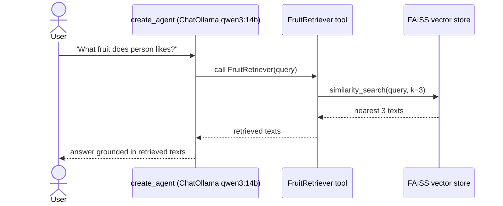

# lalalangchain — Retriever-Tool Agent

Closing the RAG loop: wrap the FAISS vector store from the similarity-search lesson in a **tool**, hand it to an agent, and let the agent decide when to retrieve before answering.

## What this lesson covers

- Turning a retriever into a tool with `create_retriever_tool`, so an LLM can call it like any other tool
- `create_agent` (LangChain 1.0) driven by a **chat** model (`ChatOllama`) rather than a plain embeddings model
- Using `system_prompt` to push the agent toward calling the tool instead of guessing from parametric knowledge
- Reading an agent's reply out of the returned message list: `result["messages"][-1].content`

## How it works



1. The FAISS store from the similarity-search lesson is wrapped with `.as_retriever(search_kwargs={"k": 3})`.
2. `create_retriever_tool` turns that retriever into a `FruitRetriever` tool the agent can call.
3. `create_agent` wires the tool to `ChatOllama(model="qwen3:14b")`, with a `system_prompt` instructing the agent to always call `FruitRetriever` before answering.
4. The agent decides to call the tool, gets back the nearest stored statements, and answers using only that context.

## Why this is interesting

Lesson 04 showed the *retrieval* half of RAG in isolation — a bare `similarity_search` call. This lesson shows the *generation* half hooked up to it: the LLM itself decides when retrieval is useful, calls it as a tool, and grounds its answer in what comes back, instead of answering from memory alone.

Without the `system_prompt` nudge, `qwen3:14b` sometimes answers directly (and vaguely) instead of calling the tool — a reminder that tool availability alone doesn't guarantee tool use; the model still has to be steered toward it.

## Requirements

- Python 3.12+
- [Ollama](https://ollama.com) running locally with `qwen3-embedding` and `qwen3:14b` pulled
- [uv](https://docs.astral.sh/uv/)

## Setup

```bash
# Pull the models (one-time)
ollama pull qwen3-embedding
ollama pull qwen3:14b

# Install Python dependencies
uv sync
```

## Run

```bash
uv run main.py
```

The script builds the FAISS store, wraps it as a tool, and asks the agent "What fruit does person likes?" — the agent calls `FruitRetriever` and prints its grounded answer.

## Key files

| File | Purpose |
|---|---|
| [main.py](main.py) | Builds the FAISS store, wraps it as a tool, and runs the agent |
| [pyproject.toml](pyproject.toml) | Project dependencies |

## Dependencies

| Package | Role |
|---|---|
| `langchain` | `create_agent` |
| `langchain-core` | `create_retriever_tool` |
| `langchain-ollama` | `ChatOllama` and `OllamaEmbeddings` |
| `langchain-community` | FAISS vector store integration |
| `faiss-cpu` | The underlying similarity-search index |

---

> One of several standalone LangChain lessons — see the [`main` branch](../../tree/main) for the full list.
