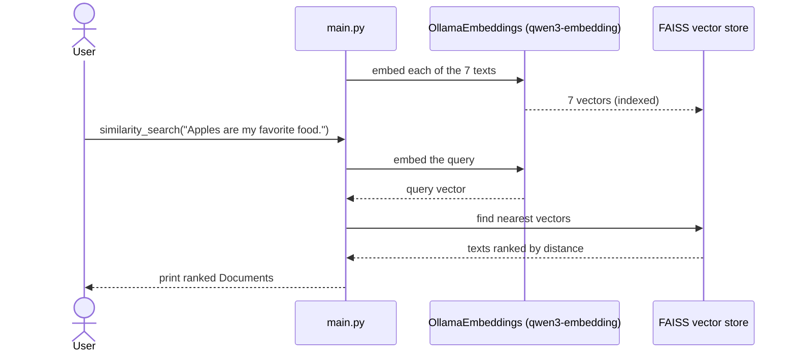

# lalalangchain — Similarity Search

The retrieval half of a RAG pipeline: turn text into **embeddings**, store them in a **vector store**, and **search by meaning** instead of by keyword.

## What this lesson covers

- What an **embedding** is: a piece of text turned into a vector that captures its meaning
- Building a **vector store** (FAISS) from a list of texts with `FAISS.from_texts`
- Running a **similarity search** — the query is embedded the same way, then the store returns the nearest texts by vector distance
- Seeing embeddings capture *meaning*, not spelling: "apple" the fruit vs. Apple the company separate cleanly

## How it works



1. `OllamaEmbeddings` embeds each of the seven sentences into a vector.
2. `FAISS.from_texts` stores those vectors in an in-memory index.
3. `similarity_search(query, k=7)` embeds the query with the *same* model and returns the stored texts ordered from nearest to farthest.

## Why this is interesting

The same word can mean different things, and embeddings pick up on that from context:

| Query | Top results | Why |
|---|---|---|
| `Apples are my favorite food.` | `I love apples.`, `I enjoy oranges.`, `I think pears taste very good.` | the **fruit** sense wins |
| `Linux is a great operating system.` | `Apple makes very good computers.`, `I am a fan of MacBooks.`, `I like Lenovo ThinkPads.` | the **computing** sense wins |

No sentence shares a keyword with either query — the ranking comes entirely from meaning. This retrieval step is exactly what a RAG app does before handing the top results to an LLM as context.

## Requirements

- Python 3.12+
- [Ollama](https://ollama.com) running locally with `qwen3-embedding` pulled
- [uv](https://docs.astral.sh/uv/)

## Setup

```bash
# Pull the embedding model (one-time)
ollama pull qwen3-embedding

# Install Python dependencies
uv sync
```

## Run

```bash
uv run main.py
```

The script builds the vector store, runs two similarity searches, and prints the ranked `Document`s for each.

## Key files

| File | Purpose |
|---|---|
| [main.py](main.py) | Builds the FAISS store and runs the similarity searches |
| [pyproject.toml](pyproject.toml) | Project dependencies |

## Dependencies

| Package | Role |
|---|---|
| `langchain-ollama` | Ollama embeddings integration (`OllamaEmbeddings`) |
| `langchain-community` | FAISS vector store integration |
| `faiss-cpu` | The underlying similarity-search index |

---

> One of several standalone LangChain lessons — see the [`main` branch](../../tree/main) for the full list.
