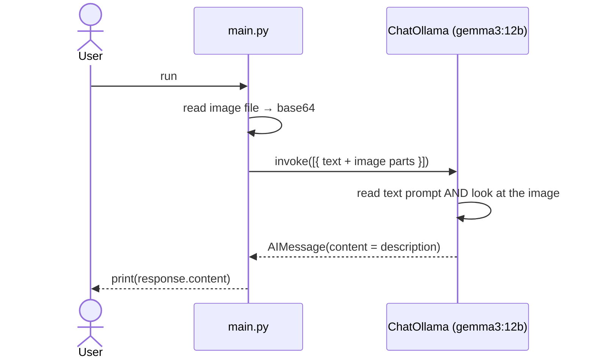

# lalalangchain — Multimodal Input

Sending **more than one modality** — text *and* an image — to a single vision-capable model through Ollama, and getting back a description of the image.

## What this lesson covers

- What *multimodal input* means: one model, multiple input modalities (text + image)
- Building a message with a **content list** of typed parts (`{'type': 'text', ...}` and `{'type': 'image', ...}`)
- Encoding a local image as base64 and passing it with its `mime_type`
- Using a **vision-capable** model (`gemma3:12b`) — a text-only model can't process the image part

## How it works



1. The script reads a local image and base64-encodes it.
2. It builds a single user message whose `content` is a **list of parts** — a text instruction plus the image (with `base64` and `mime_type`).
3. `model.invoke([message])` sends both parts to `gemma3:12b`, which can read text *and* see images.
4. The model returns a normal `AIMessage`; `response.content` holds its description of the image.

## Why a vision model?

"Multimodal" describes the **kinds of data** a model accepts, not the number of models. A single model handles both modalities — but only if it was trained with vision. `gemma3` is vision-capable; a text-only model like `qwen3` would have nothing to do with the image part.

## Requirements

- Python 3.12+
- [Ollama](https://ollama.com) running locally with `gemma3:12b` pulled
- [uv](https://docs.astral.sh/uv/)

## Setup

```bash
# Pull the model (one-time)
ollama pull gemma3:12b

# Install Python dependencies
uv sync
```

## Run

Point `local_image` in [main.py](main.py) at an image on your machine, then:

```bash
uv run main.py
```

The script asks the model to _"Describe the contents of the image in detail."_ and prints the description.

## Key files

| File | Purpose |
|---|---|
| [main.py](main.py) | Builds the multimodal message and invokes the model |
| [pyproject.toml](pyproject.toml) | Project dependencies |

## Dependencies

| Package | Role |
|---|---|
| `langchain-ollama` | Ollama chat model integration (`ChatOllama`) |

---

> One of several standalone LangChain lessons — see the [`main` branch](../../tree/main) for the full list.
